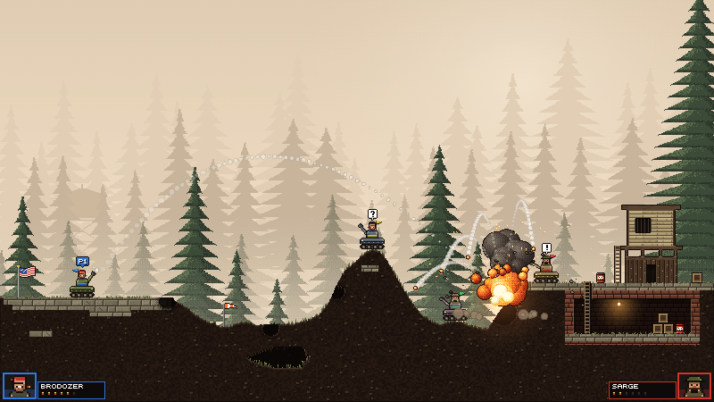

# Tanks

Artillería por turnos: las reglas de **Scorched Earth** con la estética de **Broforce**. Un humano contra 1 a 3 IAs en rondas con tienda y hot-seat local, o solo mira la IA jugar en el demo.



## Dónde jugar

Abrí el navegador en https://facus1979.github.io/tanks/

## Jugar online con amigos

1. En el menú elegí **ONLINE → CREAR SALA**. Aparece un código (por ejemplo `TANK-4F7K`) y el botón **COPIAR LINK**.
2. Pasale el link a tus amigos. Al abrirlo entran directo al lobby y toman un casillero libre.
3. Vos, como anfitrión, elegís qué casilleros son humanos remotos, IA o vacíos, las rondas, la dificultad, el bioma y el tiempo por turno, y apretás **EMPEZAR**.

- La conexión es directa entre navegadores (WebRTC); no hay servidor propio.
- Si alguien se desconecta, su tanque lo juega la IA hasta que vuelva a abrir el link.
- Si el anfitrión cierra el juego, la partida termina.
- Algunas redes muy cerradas (por ejemplo, redes corporativas) pueden bloquear WebRTC. Desde redes hogareñas normalmente funciona.

## Cómo correrlo local

```bash
npm install
npm run dev
```

Luego abrí http://localhost:5173 en tu navegador.

## Controles

| Tecla | Acción |
|---|---|
| **Izquierda / Derecha** | Sube / baja el ángulo |
| **Arriba / Abajo** | Sube / baja la potencia |
| **A / D** (mantener) | Mueve el tanque gastando combustible |
| **1 a 8** o click | Elige arma |
| **Espacio** | Dispara |
| **Q** | Activa el escudo |
| **F** | Usa combustible extra |
| **R** | Usa reparación |
| **T** | Activa el trazador (muestra la trayectoria del próximo tiro) |
| **P** | Pausa |
| **M** | Silencia / activa el sonido |

**Gamepad:** stick izquierdo o cruceta para ángulo y potencia, gatillos o bumpers para mover, **A** dispara, **X / Y** arma anterior / siguiente, **B** usa el primer ítem disponible, **Start** pausa. También navega el menú, la tienda, la tabla y el cartel de turno.

**Celular y tablet:** poné el dispositivo en horizontal. Arrastrá el dedo sobre el campo de batalla para apuntar: la dirección es el ángulo y el largo del arrastre la potencia. Los botones en pantalla ajustan fino (POT ±, ÁNG ↺ ↻), mueven el tanque (◀ ▶, mantener apretado), cambian de arma, usan ítems y disparan (FUEGO). Arriba a la derecha están la pausa y la pantalla completa. Para unirte a una sala desde el celular, lo más simple es abrir el link que te pasan.

## Modos de juego

### Rondas y tienda
Elige 1, 3, 5 o 10 rondas. Entre rondas:
- Tabla de puntuación (daño, kills, supervivencia)
- Tienda: compra armas, escudo, paracaídas, combustible, reparación, trazador
- IA compra automáticamente (con su dificultad)

### Hot-seat local
En el menú, cada uno de los 4 casilleros puede ser Humano, IA o Vacío. Con dos o más humanos, un cartel avisa de quién es el turno antes de habilitar los controles. Para probarlo directo: `?play=1&humans=2&bots=1&rounds=3`.

### Demo (QA visual)
- `?demo=1`: IA vs IA automático, bosque
- `?demo=1&freeze=0`: demo sin congelar
- `?demo=1&weapon=cluster`: prueba un arma específica
- `?demo=1&biome=jungle`: cambia el bioma

### Juego rápido
- `?play=<seed>`: entra directo a humano vs 2 IAs
- `?play=<seed>&biome=industrial`: con bioma específico

## Armas

| # | Arma | Radio | Daño | Munición | Efecto |
|---|---|---|---|---|---|
| 1 | Normal | 14 | 22 | 99 | Explosión |
| 2 | Pesada | 26 | 36 | 2 | Explosión grande |
| 3 | Tierra | 18 | 20 | 3 | Agrega tierra |
| 4 | Racimo | 10 | 12 c/u | 2 | Se parte en 5 |
| 5 | Napalm | 16 | 14 + fuego | 2 | Quema la superficie |
| 6 | Excavadora | 9 | 10 | 2 | Cava túnel de 80 px |
| 7 | Rodadora | 16 | 30 | 2 | Rueda cuesta abajo |
| 8 | Nuke | 60 | 55 | 1 | Explosión masiva |

## Estructura del proyecto

```
src/
  sim/       Simulación pura (física, daño, IA)
  render/    Renderer con PixiJS
  game/      Sesión local, playback, turno de IA
  ui/        Vistas: menú, tienda, tabla, HUD
  input/     Teclado y gamepad
  audio/     Efectos de sonido

scripts/
  paint-assets.mjs    Genera arte en PNG desde código
  sim-check.ts        Pruebas de simulación
  screenshot.mjs      QA: captura de juego
```

## Scripts disponibles

- `npm run dev` — Servidor de desarrollo (Vite)
- `npm run build` — Build de producción en `dist/`
- `npm run sim-check` — Ejecuta pruebas de simulación
- `npm run net-test` — Prueba online de punta a punta: dos pestañas de Chrome juegan una partida y tienen que terminar con el mismo estado (`NET_TEST_TRANSPORT=peer` la corre por internet con PeerJS)
- `npm run preview` — Previsualiza el build

Capturas para QA:
```bash
node scripts/screenshot.mjs "demo=1" capture.png --small
node scripts/screenshot.mjs "play=5" capture.png --crop 0,0,800,450 --scale 3
```

## Reglas rápidas

- **Vida:** 100 HP. Gana el último tanque en pie.
- **Viento:** visible antes de apuntar, afecta el proyectil (-10 a 10).
- **Ángulo:** 0° = derecha, 90° = arriba, 180° = izquierda.
- **Terreno:** deformable según el material. Si desaparece el piso, el tanque cae y recibe daño.
- **Combustible:** limitado por turno; permite subir escalones hasta 3 px.
- **Fuego en cadena:** los barriles explotan al impacto.

## Biomas

- **Bosque** — Plataformas de piedra, niebla, pinos
- **Jungla** — Follaje denso, capas, luz cálida
- **Industrial** — Búnker de metal, atardecer, chimenea

## Referencia visual

Todas las capturas de QA se comparan contra `preview/look-test-1080.png`, generada por `scripts/lookdev/look-test.mjs`.

## Técnico

- **Resolución lógica:** 800×450 (escala nearest-neighbor al tamaño de ventana)
- **Física:** timestep fijo, determinista, sin motor de cuerpos rígidos
- **Terreno:** grilla de 800×450 píxeles con materiales (tierra, piedra, ladrillo, madera, metal, etc.)
- **Sincronización:** RNG con seed para reproducibilidad; apto para online futuro
- **Performance:** ~16.7 ms por frame en Chrome headless (GPU Intel D3D11)

## Licencia

Proyecto personal de código abierto.
